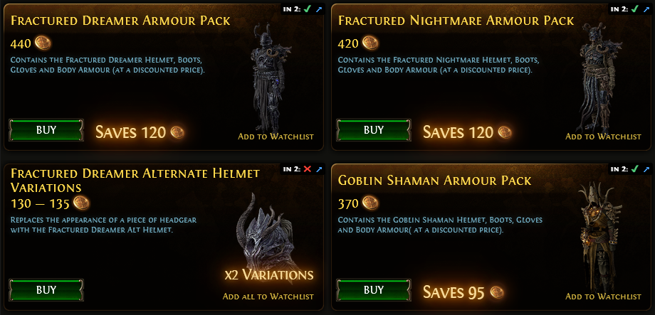
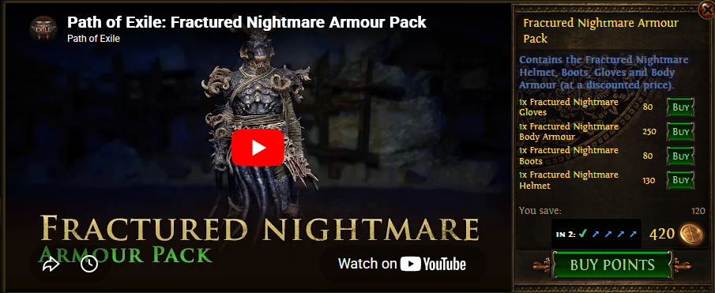

# PoE1 MTX In PoE2 Helper

> **A tool to shop PoE1 items for PoE2 with confidence.**

Check PoE1 Microtransaction availability in PoE2 directly in the shop.
This userscript overlays status indicators on each item in the PoE1 shop
indicating its status in PoE2 by checking PoE2DB.

> This isn't any sort of a hack, or anything, just makes it simpler to know
> which PoE1 items will work in 2.
> 
> The *ONLY* data taken from the shop and used anywhere else in this project is
> the IDs for the items.
>
> This won't make your shop purchases free, it doesn't even load on checkout
> pages, nothing like either of those things.

---

## 🚀 Install

You need a userscript manager extension installed first.
1. **Install [Violentmonkey](https://violentmonkey.github.io/get-it/)** (or the original, but closed source, [Tampermonkey](https://www.tampermonkey.net/))
2. Click the button below to install the script.

*(this should open a new tab, with a prompt from `*`monkey to install the user script)*

---

## 🛠 How It Works

To provide this functionality reliably without hammering external APIs, the project uses a two-part architecture:

### 1. The Userscript (Client-Side)
The `.user.js` file runs locally in your browser when you visit `pathofexile.com/shop`.
- **Detection:** It scans the DOM for shop items, packs, and purchase modals.
- **Overlay:** It injects CSS indicators (✓, ◐, ✖, ?, ⏱) indicating if the item is available in PoE2.
- **Lazy Loading:** It only checks items currently visible on screen to keep your browser responsive.
- **Local Caching:** It stores results in `localStorage` (for a few hours) so checking the same page again is much more instant.
- **Change Detection:** It scans for DOM changes, and will update in kind, such as when you search on the shop.

### 2. The Proxy Worker (Cloudflare)
When the script encounters an unchecked microtransaction ID, it queries the
Cloudflare Worker at `p1mip2.zbee.codes`.
- **Why a Worker?**  
  - **Stability:** PoE2DB can be flaky or slow, and the data isn't changing that fast. If it bogs down, the Worker returns cached data.
  - **Performance:** Batching requests allows us to fetch multiple IDs in a single round-trip.
  - **Rate Limiting Protection:** Instead of your computer sending 50 requests per minute to poe2db.tw (which could get you IP-blocked), the Worker manages that traffic centrally.

---

## 🤔 What's missing?

- Currently this was only built out for the amor section of the shop.
  - It doesn't rule out other types of items, or even try (like skill effects of any nature in PoE1 won't work in 2, obviously)
- It was only tested on the English shop, and with English PoE2DB.
  - The version of PoE2DB shouldn't matter, that can stay hard-coded to English forever, doesn't affect the user at all.
  - But for other languages of the PoE shop? That's more of an issue, no clue if it would work or not.
- Supporter packs are not supported at all either.
  - Really the same as the first point, but is something I would like to specifically have working.

---

## 🔍 Indicators Guide

| Icon  | Meaning         | Explanation                                                   |
| :---: | :-------------- | :------------------------------------------------------------ |
|   ✓   | **Available**   | The exact item or all variants in a pack are found in PoE2.   |
|   ◐   | **Partial**     | Only some variants in a pack are available in PoE2.           |
|   ✖   | **Unavailable** | The item was checked but no match was found on PoE2DB.        |
|   ?   | **Error**       | Network failure or parsing issue (check tooltip for details). |
|   ⏱   | **Loading**     | Currently queued for verification.                            |

(there's also detailed tooltips if you hover over any of the symbols drawn on
the PoE1 shop)

---

## 🤝 Contributing & Feedback

Found a bug? The PoE shop layout and PoE2DB can change.
If the script stops working after an update:
1. Check the Browser Console (F12) for errors prefixed with `[PoE1-MTX-In-PoE2-Helper]`.
2. Verify if `p1mip2.zbee.codes` is reachable.
3. Open an Issue on GitHub with a screenshot and the console log output.

---

## 💡 Development Note & AI Usage

**AI Usage Disclosure:**
This project used Lumo and Copilot heavily to make the original working project,
and to develop the html injection and identification.

I wouldn't say it was vibe-coded, but it was more AI than I have used on other
projects for sure; I did still test all of the output extensively, reviewed
individual changes (though not entire additions), and am personally using it.

(for context, this was developed over a couple of days, not in a few prompts)

---

## 📄 License

    PoE1-MTX-In-PoE2: A tool to shop PoE1 items for PoE2 with confidence.
    Copyright (C) 2026  Ethan Henderson (zbee) <ethan@zbee.codes>

     This program is free software: you can redistribute it and/or modify
     it under the terms of the GNU Affero General Public License as published
     by the Free Software Foundation, either version 3 of the License, or
     (at your option) any later version.

     This program is distributed in the hope that it will be useful,
     but WITHOUT ANY WARRANTY; without even the implied warranty of
     MERCHANTABILITY or FITNESS FOR A PARTICULAR PURPOSE. See the
     GNU Affero General Public License for more details.

     You should have received a copy of the GNU Affero General Public License
     along with this program. If not, see <https://www.gnu.org/licenses/>. 

See [LICENSE](./LICENSE) for full text.